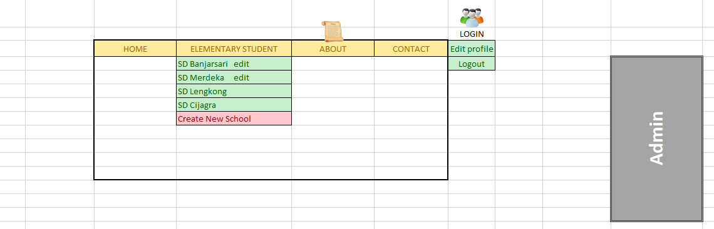
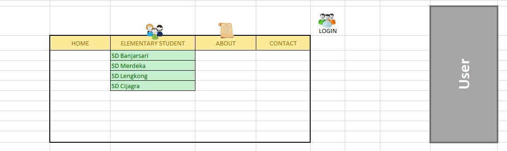
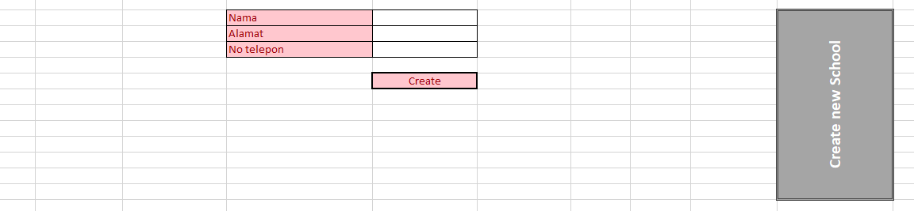
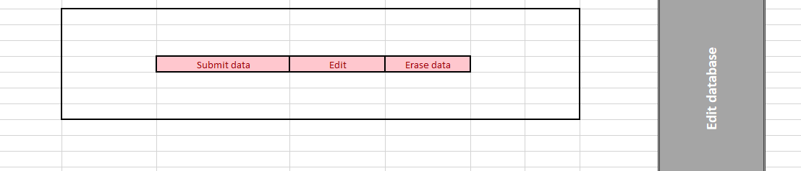
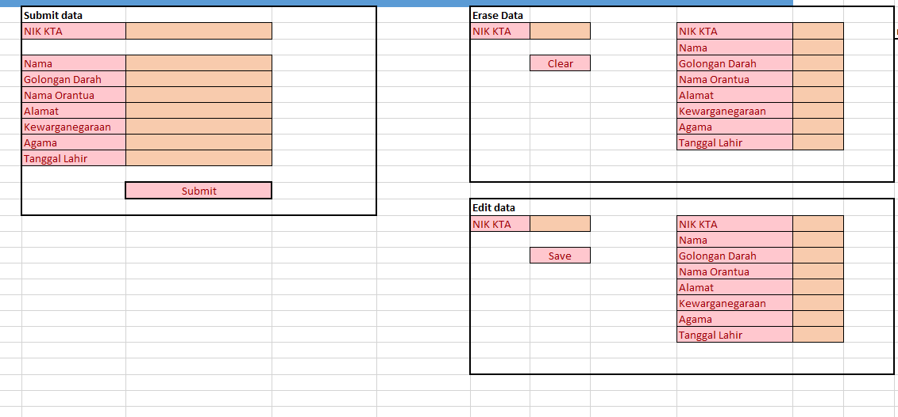

# Smart Elementary

## Penjelasan Apps

Aplikasi ini merupakan suatu bagian terkecil dari pendataan untuk Smart City Apps yang difungsikan untuk mengamati, menginputkan, serta memperbaharui kondisi yang terjadi dalam suatu wilayah.

Payload program ini mengarah pada sasaran pendataan anak - anak yang berada pada Sekolah Dasar (SD) di wilayah kota Bandung dengan tujuan untuk mendata SD mana saja yang sudah melaksanakan program vaksinasi secara berkala dan teratur.

Pada dasarnya, program ini terdiri dari dua peran yang berbeda (Admin dan User), yang berfungsi untuk mengatur dan mengawasi setiap program yang ada pada setiap SD yang terdaftar. Admin di sini akan dipegang oleh dinas pendidikan, sementara untuk User hanya akan dipegang oleh kepala sekolah atau pegawai yang ditugaskan untuk mengawasi data tersebut.

## Metode

Program yang akan digunakan dalam payload project kali ini adalah sebagai berikut:

1. Sasaran Aplikasi: Mobile Apps (Android dengan versi terendah adalah Android KitKat).
2. Platform: Firebase (fokus pada App Engine dengan fitur yang digunakan adalah Cloud Firestone, Firebase Auth, serta Real-Time Firebase).
3. Template: MaterialX (diambil dari Material Design Google).

## Gambaran dasar

Secara umum, menu yang ditampilkan terdiri dari beberapa menu, antara lain:

1. Menu utama untuk Admin
   Menu ini hanya akan ada di role Admin:
   

2. Menu utama untuk Admin
   

3. Sub menu untuk pembuatan data sekolah
   Fungsi ini khusus tersedia di Admin:
   
   
4. Sub menu data sekolah
   Fungsi ini hanya akan ada di role Admin:
   

5. Sub menu pencarian dan input data sekolah:
   Fungsi ini hanya akan ada di role Admin:
   
   
##### Progress: Tampilan untuk User masih dalam tahap proses.